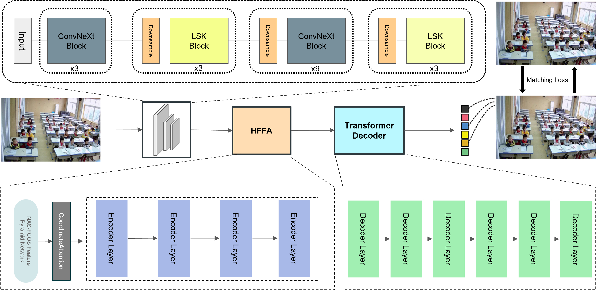

# SCB-DETR: Multi-Scale Deformable Transformers for Occlusion-Resilient Student Learning Behavior Detection

SCB-DETR is a novel end-to-end object detection framework designed to detect student learning behaviors in complex classroom environments. It is built on top of the MMDetection framework and integrates two key components: the LKNeXt backbone and the Hybrid Feature Fusion Architecture (HFFA). This model is robust to occlusion, scale variation, and behavioral similarity, making it highly effective for smart classroom applications.

## Overview

Conventional student behavior detection models often struggle with occlusion, blur, and scale variance. SCB-DETR addresses these challenges through:

- LKNeXt: A large-kernel convolutional backbone designed to enhance upstream feature extraction
- HFFA: A hybrid feature fusion module combining multi-scale pyramid features and deformable attention
- SCBheavior Dataset: a specific dataset for student behavior detection

## SCB-DETR Framework

## Implementation Notes

Our code is implemented based on the MMDetection framework.

The specific configuration files for SCB-DETR are located in:**/mmdetection-main/mmdetection-main/configs/SCB-DETR**

For dataset preparation, model training, and evaluation, please refer to the standard MMDetection configuration and usage style. You may follow the official MMDetection documentation for details on how to define datasets, modify model backbones, and run training/testing pipelines.

